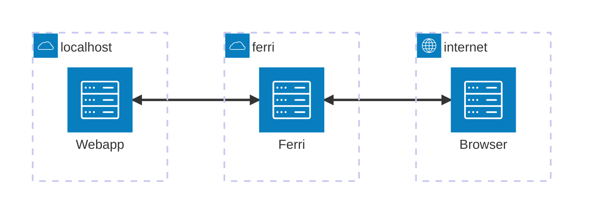

# Ferri

Ferri tunnels HTTP traffic from your localhost through a free SSL-terminating endpoint. You can use it for free, or host it yourself.




## Using Ferri

To run Ferri you can run the `ferri` client locally and point it to a
web-application running on `localhost`. Assuming I have a webapp running at
`localhost:4444` this will give you a public-facing URL.


```shell
% ferri 4444
Tunnel live at https://greatest-app.ferri.run -> localhost:4444
GET /    112ms Rx: 1102B, Tx: 2557B
```
## Features

 - SSL termination at the Ferri host
 - Random human-readdable URLs
 - Single-binary local client

## Run Locally

You can run Ferri locally fairly easily by cloning this repo and then doing the following.

```shell
# Start the backend
iex -S mix phx.server
```

```shell
cd ferri-client/ferri
cargo run <local port>
```

Note: on macOS any subdomain to `localhost` resolves to `localhost` so when
Ferri returns `http://foo.localhost:8080` it will resolve to localhost. I have
not tested or tried this on Linux.


## Why?

I built this because I was looking for a fun project to build that would expose
me to new things. It started out by implementing the simple
[Yamux](https://github.com/hashicorp/yamux) protocol after reading the [Network
Programming in Elixir and Erlang
book](https://pragprog.com/titles/alnpee/network-programming-in-elixir-and-erlang/)
by Andrea Leopardi. I personally like using ngrok, and it works perfectly fine.
I find it an interesting piece of software and wondered how it all worked
exactly.


## Self-hosting

To self-host Ferri you need a handful of things:

 - A VPS
 - A domain name with a wildcard A-record
 - A webserver that supports wildcard domains

I currently host Ferri on a VPS with Caddy and a wildcard domain at Gandi.
