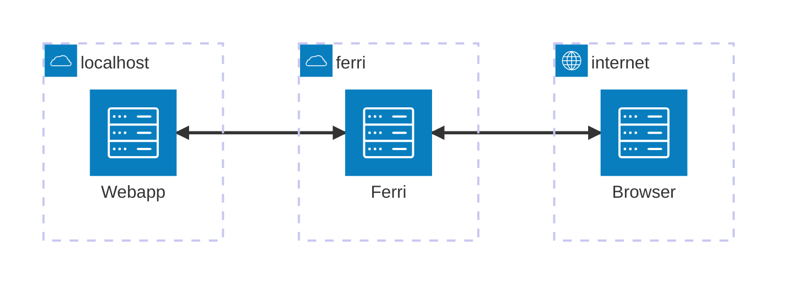
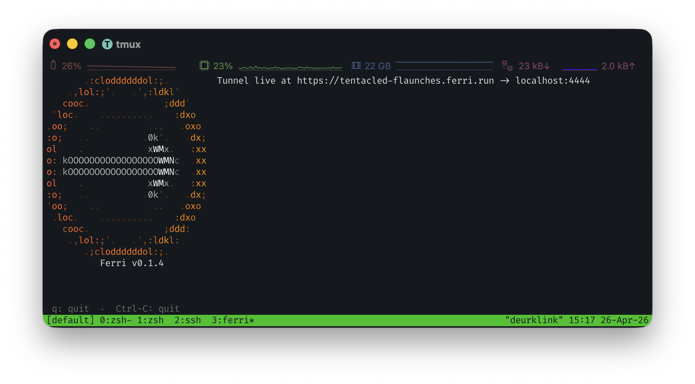

# Ferri

Ferri tunnels HTTP traffic from your localhost through a free SSL-terminating endpoint. You can use it for free, or host it yourself.




## Using Ferri

To run Ferri you can run the `ferri` client locally and point it to a
web-application running on `localhost`. Assuming I have a webapp running at
`localhost:4444` this will give you a public-facing URL.

You can install the client using the following command. Check the source of the script [here](https://raw.githubusercontent.com/m1dnight/ferri/refs/heads/main/scripts/install.sh).

```bash
curl -fsSL https://raw.githubusercontent.com/m1dnight/ferri/refs/heads/main/scripts/install.sh | sh
```

Then run Ferri and point it to a local HTTP port.

```shell
ferri 4444
```


## Features

 - SSL termination at the Ferri host
 - Random human-readdable URLs
 - Single-binary local client

## Run Locally

You can run Ferri locally fairly easily by cloning this repo and then doing the following.

```shell
# Start the backend
iex -S mix phx.server
```

```shell
cd ferri-client/ferri
cargo run <local port>
```

Note: on macOS any subdomain to `localhost` resolves to `localhost` so when
Ferri returns `http://foo.localhost:8080` it will resolve to localhost. I have
not tested or tried this on Linux.


## Why?

I built this because I was looking for a fun project to build that would expose
me to new things. It started out by implementing the simple
[Yamux](https://github.com/hashicorp/yamux) protocol after reading the [Network
Programming in Elixir and Erlang
book](https://pragprog.com/titles/alnpee/network-programming-in-elixir-and-erlang/)
by Andrea Leopardi. I personally like using ngrok, and it works perfectly fine.
I find it an interesting piece of software and wondered how it all worked
exactly.


## Self-hosting

To self-host Ferri you need a handful of things:

 - A VPS
 - A domain name with a wildcard A-record
 - A webserver that supports wildcard domains

I currently host Ferri on a VPS with Caddy and a wildcard domain at Gandi.

To run Ferri on a VPS, you need to install Caddy and Ferri as a SystemD service.


### Ferri

#### From Source
Create a release on a machine with the same architecture are your VPS. I.e., you
cannot build this on  Apple Silicon and deploy on an x86 VM.

```bash
just release
```

This will produce the release under `_build/prod/rel`. Copy these files onto
your VPS into `/opt/`.

#### From GitHub

You can fetch any release from the release page [here](https://github.com/m1dnight/ferri/releases). Copy the extracted output to `/opt/` like below.

### SystemD

Then create `/etc/ferri/env`
```bash
PHX_SERVER=true
SECRET_KEY_BASE=GENERATE_WITH_mix phx.gen.secret # Generate this !
PORT=4000
PHX_HOST=yourvps.com
# if you want to have remote shell access (e.g., with Tailscale)
RELEASE_DISTRIBUTION=name
RELEASE_NODE=ferri@ferri.mytailnet.ts.net.
RELEASE_COOKIE=cookiesaregreat
```

Set permissions

```bash
sudo chown ferri:ferri /etc/ferri/env
sudo chmod 0600 /etc/ferri/env
```

Create the SystemD file

```bash
[Unit]
Description=Ferri tunnel server
After=network.target

[Service]
Type=exec
User=ferri
Group=ferri
WorkingDirectory=/opt/ferri
EnvironmentFile=/etc/ferri/env
ExecStart=/opt/ferri/bin/ferri start
Restart=always
RestartSec=5
LimitNOFILE=65536

[Install]
WantedBy=multi-user.target
```

Start the service

```bash
sudo systemctl daemon-reload
sudo systemctl enable --now ferri
```

### Caddy

Caddy is fairly straightforward. The only annoying thing is setting up a
wildcard Let'sEncrypt. For Gandi and Caddy, the following works.

In the `/etc/caddy/Caddyfile`:

```
{
      email foo@bar.com
}

*.ferri.run, ferri.run {
      tls {
            dns gandi {env.GANDI_API_TOKEN}
            resolvers ns1.gandi.net ns2.gandi.net ns3.gandi.net
      }
      reverse_proxy localhost:8080
}
```

In `/etc/sytemd/system/caddy.service`

```
[Unit]
Description=Caddy
After=network-online.target
Requires=network-online.target

[Service]
Type=notify
User=caddy
Group=caddy
EnvironmentFile=/etc/caddy/caddy.env
ExecStart=/usr/local/bin/caddy run --environ --config /etc/caddy/Caddyfile
ExecReload=/usr/local/bin/caddy reload --config /etc/caddy/Caddyfile --force
TimeoutStopSec=5s
LimitNOFILE=1048576
AmbientCapabilities=CAP_NET_BIND_SERVICE

[Install]
WantedBy=multi-user.targe
```

In `/etc/caddy/caddy.env`:

```
GANDI_API_TOKEN=your_gandi_api_token
```

### Firewall

Optionally, if you want to use UFW:

```bash
sudo ufw allow 22/tcp
sudo ufw allow 80/tcp
sudo ufw allow 443/tcp
sudo ufw allow 59595/tcp
sudo ufw --force enable
```